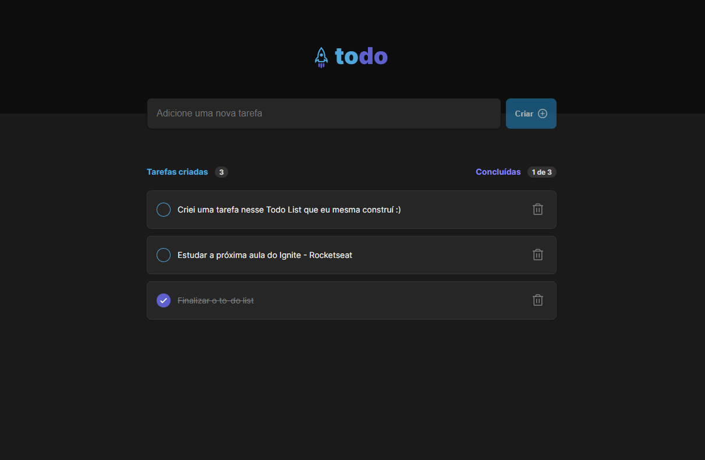
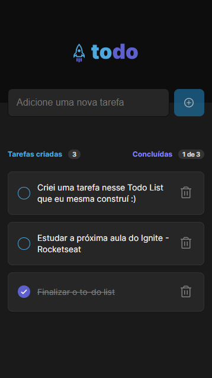

# Desafio ToDo List

Desenvolver uma aplicação de controle de tarefas no estilo **to-do list**, que contém as seguintes funcionalidades:

- Adicionar uma nova tarefa
- Marcar e desmarcar uma tarefa como concluída
- Remover uma tarefa da listagem
- Mostrar o progresso de conclusão das tarefas

Conceitos aplicados:

- Estados
- Imutabilidade do estado
- Listas e chaves no ReactJS
- Propriedades
- Componentização

Funcionalidades extras ao desafio:

- Snackbar
- Persistencia de dados no localStorage
- Responsividade
- Deploy da aplicação

Tecnologias:

- React
- Typescript
- CSS Modules

Link do ToDo online:
[ToDo List](https://sa-todo-list.vercel.app/)

### Screenshots do ToDo list:

- Versão Desktop

- ToDo list Mobile

Design da aplicação por Rocketseat.
